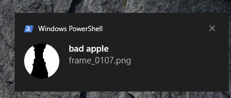

# bad-apple-notification
welcome to my little stupid project where i abuse windows notification library called burnttoast to its limits
i tested it on an i3 2120 PC running windows 10 iot ltsc 2021, it might be supported for windows 11 too. i'm testing it rn

to download *click code* and then *download zip*

~ edited on 1/6/26
## how to run?
### 1. install BurntToast module by following this step (run powershell as admin)
> Set-ExecutionPolicy RemoteSigned -Scope CurrentUser

> Install-Module BurntToast -Scope CurrentUser

> Import-Module BurntToast

now check if it's working
> New-BurntToastNotification -Text "test", "test"

if it's working do step 2

### 2. download the zip (i already show you how to do it)
### 3. extract the 7z files
### 4. extract the frames.7z with 7zip > extract to
### 4. uhhh do this, im shit at tutorials
> 
### 5. run the .ps1 file by "right click > run with powershell" 

enjoy
